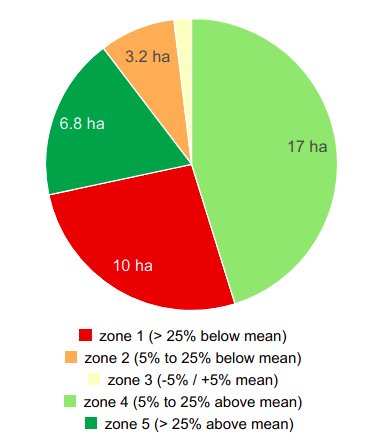
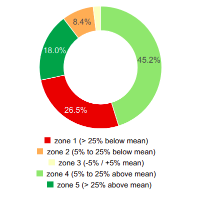

# gc-zones-chart widget
## Description
gc-zones-chart is an embeddable JavaScript/HTML widget for visualizing the outputs of the ag|knowledge REST API from [geocledian](https://www.geocledian.com).
It is built as a reusable [Vue.js](https://www.vuejs.org) component which allows the integration in [Vue.js](https://www.vuejs.org) applications smoothly. 
You may but you don't have to build the rest of the container application with [Vue.js](https://www.vuejs.org).

## Purpose
With this widget you are able to visualize the farm management zones JSON output from the REST API of ag|knowledge from geocledian.com.

The following modes are supported:
- pie<br>


- donut<br>


## Configuration
This widget is customizeable via HTML attributes and supports the setting of the following attributes.

### Basic options
- gc-apikey: API Key from geocledian, e.g. "39553fb7-7f6f-4945-9b84-a4c8745bdbec"; default: '39553fb7-7f6f-4945-9b84-a4c8745bdbec'
- gc-host: base host, e.g. "geocledian.com"; default: 'geocledian.com'
- gc-mode: choose from "pie" or "donut"; see above for details; default: "pie"
- gc-zones-data: JSON data from ag|knowledge zones endpoint; e.g. from root Vue instance "$root.zonesData"; default: {}
- gc-language: initial locale language for translation, e.g. "en" for english; default: "en"
  
### UI options
- gc-available-options: limit the available options, e.g. "" for not title at all; default: "title,description,legend"
- gc-legend-position: sets the position of the legend of the chart: 'bottom', 'right' or 'inset'; default: 'bottom'
- gc-widget-collapsed: start the widget collapsed or not; default: "false"
- gc-white-label: white label use of widget (= hide geocledian logo); default: "false"

## Integration
For the integration of the widget you'll have to follow two steps.

You have to add some dependencies in the head tag of the container website.

```html
<html>
  <head>

    <!--GC zones-chart component begin -->

    <!-- loads also dependent css files via @import -->
    <link href="css/gc-zones-chart.css" rel="stylesheet">
    <!-- init script for components -->
    <script type="text/javascript" src="js/gc-zones-chart.js"></script> 
     
    <!--GC zones-chart component end -->
  </head>

```

Then you may create the widget(s) with custom HTML tags anywhere in the body section of the website. Make sure to use an unique identifier for each chart component (chartid).

>As this widget does not make API calls itself you'll have to pass JSON data from the ag|knowledge zones endpoint to the property `gc-zones-data`.


```html
<div id="gc-app">
  <gc-zones-chart 
    gc-widget-id="zonesChart1"
    :gc-zones-data="$root.zonesData"
  />
</div>
```

## Support
Please contact [us](mailto:info@geocledian.com) from geocledian.com if you have troubles using the widget!

## Used Libraries
- [Vue.js](https://www.vuejs.org)
- [Vue I18n](https://kazupon.github.io/vue-i18n/)
- [billboard.js](https://naver.github.io/billboard.js/)
- [axios](https://github.com/axios/axios)
- [Bulma](https://bulma.io/documentation/)
- [Font awesome](https://fontawesome.com/)
  
## Legal: Terms of use from third party data providers
- You have to add the copyright information of the used data. At the time of writing the following text has to be visible for [Landsat](https://www.usgs.gov/information-policies-and-instructions/crediting-usgs) and [Sentinel](https://scihub.copernicus.eu/twiki/pub/SciHubWebPortal/TermsConditions/TC_Sentinel_Data_31072014.pdf) data:

```html
 contains Copernicus data 2021.
 U.S. Geological Service Landsat 8 used in compiling this information.
```

**geocledian is not responsible for illegal use of third party services.**
